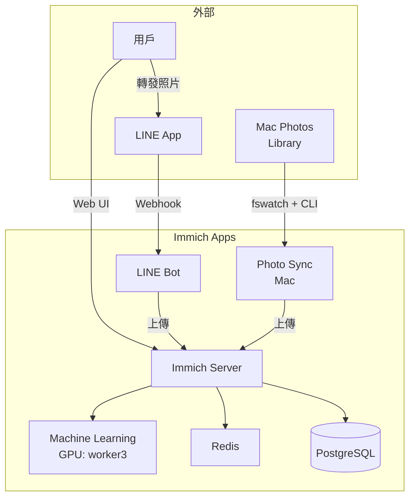

# Immich Apps

**完整的 Immich 生態系統**：Immich server + LINE Bot + Photo Sync

> 🚀 **Status**: 開發中  
> 📊 **Progress**: [PROGRESS_TRACKING.md](./docs/PROGRESS_TRACKING.md)  
> 🏗️ **Architecture**: [REPO_CONSOLIDATION_PLAN.md](./docs/REPO_CONSOLIDATION_PLAN.md)

---

## 🎯 專案簡介

統一管理所有 Immich 相關組件：

1. **Immich Server**: 核心照片管理系統（upstream Helm chart + 自定義配置）
2. **LINE Bot**: 從 LINE 自動上傳照片到 Immich + AI 標註
3. **Photo Sync**: Mac Photos Library 自動同步

---

## 📁 目錄結構

```
immich-apps/
├── deploy/
│   ├── helm/                      # Helm charts
│   │   ├── immich-server/         # Immich server
│   │   ├── immich-line-bot/       # LINE Bot
│   │   └── immich-photo-sync/     # Photo Sync
│   └── manifests/                 # kubectl manifests (備用)
├── src/
│   ├── line-bot/                  # LINE Bot TypeScript 源碼
│   ├── photo-sync/                # Photo Sync scripts
│   └── shared/                    # 共用程式碼
├── scripts/
│   ├── dev/pf.sh                  # Port-forward (30430-30439)
│   └── deploy-all.sh              # 部署所有組件
├── docs/                          # 完整文檔
│   ├── PROGRESS_TRACKING.md       # SSOT
│   ├── PHASE2_LINE_BOT.md
│   ├── PHASE3_PHOTO_SYNC.md
│   └── ...
├── Makefile
├── package.json
└── README.md
```

---

## 🚀 快速開始

### 前置條件

- Kubernetes 叢集運行中
- MetalLB 已部署
- 1Password Operator 已配置
- GPU 節點已標籤（worker3）

### 部署所有組件

```bash
# 1. Clone repo
git clone https://github.com/dejavux/immich-apps.git
cd immich-apps

# 2. 部署
make deploy-all

# 或分別部署
make deploy-server    # Immich server
make deploy-line-bot  # LINE Bot
make deploy-sync      # Photo Sync
```

### 本機開發

```bash
# Port-forward
make pf

# 開發 LINE Bot
make dev-line-bot

# 查看 logs
make logs
```

---

## 📊 組件概覽

### 1. Immich Server

- **Namespace**: `immich`
- **Components**: server, machine-learning, redis, postgres
- **Web UI**: https://immich.3q.fi
- **Storage**: lama hostPath (HDD) → 規劃遷移到 SSD

### 2. LINE Bot

- **Namespace**: `immich`
- **Port**: 30430 (port-forward)
- **Webhook**: https://immich-bot.3q.fi/webhook/line
- **Features**:
  - 從 LINE 接收照片
  - 自動上傳到 Immich
  - AI 標註（CLIP + GPT-4V）

### 3. Photo Sync

- **Type**: Mac 本機 LaunchDaemon
- **Source**: Mac Photos Library
- **Target**: Immich server
- **Method**: Immich CLI + fswatch

---

## 🛠️ 開發指南

### Makefile 命令

```bash
# 開發
make lint              # 變更檔 lint
make commit            # Lint + AI commit
make pull_request      # PR → merge

# 部署
make deploy-all        # 部署所有組件
make deploy-server     # 部署 Immich server
make deploy-line-bot   # 部署 LINE Bot

# Build & Release
make build-line-bot    # Docker build LINE Bot
make release-line-bot  # Build + Deploy

# 本機
make pf                # Port-forward (30430)
make dev-line-bot      # 本機開發 LINE Bot
make logs              # 查看 k8s logs
```

### Port Range

| Service | Port | 用途 |
|---------|------|------|
| LINE Bot | 30430 | Webhook server |
| (預留) | 30431-30439 | 未來服務 |

---

## 📚 文檔

### 核心文檔

- **[PROGRESS_TRACKING.md](./docs/PROGRESS_TRACKING.md)** - 進度追蹤 SSOT ⭐
- **[REPO_CONSOLIDATION_PLAN.md](./docs/REPO_CONSOLIDATION_PLAN.md)** - Repo 整合方案
- **[QUESTIONS_ANSWERED.md](./docs/QUESTIONS_ANSWERED.md)** - 架構決策問答

### Phase 實作

- **[PHASE2_LINE_BOT.md](./docs/PHASE2_LINE_BOT.md)** - LINE Bot 實作（P0）
- **[PHASE3_PHOTO_SYNC.md](./docs/PHASE3_PHOTO_SYNC.md)** - Photo Sync 實作（P1）

### 技術文檔

- **[GPU_CONFIGURATION.md](./docs/GPU_CONFIGURATION.md)** - GPU 配置

---

## 🏗️ 架構

### System Overview



### Deployment

- **Namespace**: `immich`
- **Ingress**: Caddy reverse proxy
- **Storage**: lama hostPath (規劃遷移到 SSD)
- **Secrets**: 1Password Operator

---

## 📊 監控

### Grafana Dashboard

- **Immich**: https://grafana.3q.fi/d/immich
- **Metrics**: `/metrics` 端點（LINE Bot, server）

### Health Checks

```bash
# Immich server
curl https://immich.3q.fi/api/server-info/ping

# LINE Bot
curl https://immich-bot.3q.fi/health
```

---

## 🔧 疑難排解

### 常見問題

詳見：[PHASE2_LINE_BOT.md - Troubleshooting](./docs/PHASE2_LINE_BOT.md#troubleshooting)

### 快速診斷

```bash
# 檢查 Pods 狀態
kubectl get pods -n immich

# 查看 logs
make logs

# Port-forward 測試
make pf
curl http://127.0.0.1:30430/health
```

---

## 🤝 貢獻

1. Fork repo
2. 建立 feature branch
3. Make changes
4. `make commit` (自動 lint + AI commit)
5. `make pull_request`

---

## 📝 License

MIT

---

## 🔗 相關連結

- **Immich Official**: https://immich.app/
- **LINE Messaging API**: https://developers.line.biz/
- **OpenAI Vision API**: https://platform.openai.com/docs/guides/vision

---

**最後更新**: 2026-05-27  
**維護者**: Infrastructure Team + App Dev Team  
**Repo**: https://github.com/dejavux/immich-apps
