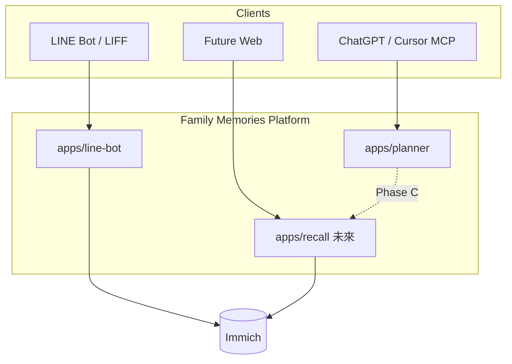

# Family Memories — 產品與平台架構

**狀態**: 📋 規劃中（架構 SSOT）  
**日期**: 2026-07-15  
**Repo 演進**: `immich-apps` → **`family-memories`**（品牌 rename + 結構重排，非大爆炸重寫）  
**相關探針**: [scripts/trip/README.md](../../scripts/trip/README.md)（雄獅搜尋 prototype，將併入 `apps/planner`）

---

## 執行摘要

| 決策 | 選擇 |
| ------ | ------ |
| 產品定位 | **家庭旅行記憶平台**：行前規劃（Planning）＋行後回憶（Memory） |
| Immich | **媒體 SSOT**（部署子系統），非產品品牌 |
| 主對話面 | **ChatGPT / Cursor MCP**（wizard、比較、深抽）；**LINE** 保留為行動上傳與輕量搜圖 |
| 規劃服務命名 | **`planner`**（不用 `trip-core`） |
| 上線節奏 | A 白名單 → B 公開 beta → C/D Memory 接線與平台 client |
| 商業化 | 賣 **家庭 workspace + Memory**，Planning 為獲客入口；不當 OTA |

---

## 產品軸線

```text
        行前 Planning                         行中 / 行後 Memory
              │                                         │
   wizard ─ search ─ extract ─ shortlist          timeline ─ map ─ spots
              │                                         │
              └──────────── Trip（一次旅行）──────────────┘
                              │
                    Immich = 照片 / 影片 SSOT
```

### 核心實體（目標模型）

| 實體 | 說明 |
| ------ | ------ |
| `Family` | 家庭 workspace；邀請碼、成員、共用 shortlist |
| `Trip` | 一次旅行（日期窗、目的地、狀態：規劃中／進行中／已結束） |
| `ItineraryCandidate` | 旅行社候選行程（`TourSummary` + 來源 URL） |
| `Place` / `Spot` | 景點、場景（對應 map、日行程） |
| `MemoryAnchor` | 將 Immich asset 掛到 Trip／Place／日期（Phase C） |

---

## Client 策略：MCP-first，LINE 為行動面

### 原則

- **Platform API** 為契約中心；MCP、LINE、未來 Web 皆為 client。
- **不以 ChatGPT 取代 LINE 上傳**；短期 LINE 仍是照片／影片進 Immich 的主通道。
- 新功能預設：**先上 MCP**（規劃、比較、日後記憶查詢），再視需要接到 LINE Flex／LIFF。

### Client 分工

| 能力 | 主 client | 備註 |
| ------ | --------- | ------ |
| 行前 wizard、搜尋、貼 URL 深抽、shortlist | **ChatGPT MCP**、Cursor MCP | 多輪對話、選項、長文比較 |
| 照片／影片上傳 | **LINE** | ChatGPT 非相簿入口 |
| 行後「找某次旅行的照片」 | LINE 搜圖（現有）→ 中期 **MCP `memory_query`** | 同一 `familyId` |
| Passkey／帳戶 | **LIFF** 或 Web | WebAuthn 限制見 [LIFF_PASSKEY_SETUP.md](../20_guides/LIFF_PASSKEY_SETUP.md) |



---

## Repo 與命名

### GitHub / 品牌

- **Repo 目標名**: `family-memories`
- **對外產品名**: Family Memories（家庭旅行記憶）
- **Immich Apps** 降為 README 內「媒體引擎／部署」子標，避免對外誤解為 Immich 外掛 repo

### 服務命名（取代 `trip-core`）

| 層級 | Planning（行前） | Memory（行後，未來） |
| ------ | ---------------- | --------------------- |
| App 目錄 | `apps/planner` | `apps/recall` 或 `apps/atlas`（地圖重時選 atlas） |
| Helm / k8s | `family-planner` | `family-recall` |
| API 前綴 | `/api/planner/v1` | `/api/recall/v1` |
| MCP server 顯示名 | `family-memories-planner` | `family-memories-recall` |
| 對外（使用者） | **家庭行程助手** | **家庭回憶** / 時間軸 |

**不用 `trip-core` 的原因**：像 infra 內部件、與 Memory 側不對稱、不利 beta 敘事。

### 目標 monorepo 結構（漸進遷移）

```text
family-memories/
├── apps/
│   ├── line-bot/          # 現 src/line-bot + liff + auth 路由（暫留原位，後遷）
│   ├── planner/           # Phase A：wizard、adapters、MCP/REST
│   └── recall/            # Phase C：timeline、map、MemoryAnchor
├── packages/
│   ├── shared/            # immich-client, logger, date, geo
│   ├── auth/              # family, api-key, passkey
│   ├── planner-schema/    # TourSummary, WizardSession
│   └── recall-schema/     # Trip, Place, MemoryAnchor
├── deploy/helm/
│   ├── immich-server/     # vendor 包裝
│   ├── line-bot/
│   └── family-planner/
├── scripts/
│   ├── photo-sync/        # 維運 only（ops 邊界）
│   └── trip/              # 探針；併入 planner 後可刪
└── docs/00_planning/
    └── FAMILY_MEMORIES_ARCHITECTURE.md  # 本檔
```

**遷移原則**：先新增 `apps/planner`，不一次搬光 `src/`；photo-sync 維持 ops 子系統。

---

## `apps/planner` 設計摘要

### Wizard（有狀態問卷，非開放式 preferences）

| Step | 欄位 | 輸入 |
| ------ | ------ | ------ |
| `when` | 出發區間 | **模糊口語 OK**（暑假、7–8 月、明年 1 月底）→ `DateWindow` |
| `duration` | 天數 | 模糊 OK（4–5 天、一週左右）→ `{ minDays, maxDays }` |
| `depart_from` | 出發地 | `TPE` / `KHH` / `RMQ` / `ANY` |
| `must` | 硬條件 ≤3 | 無購物、親子、飯店等級、不要購物站 |
| `budget` | 預算 | `<2萬` / `2–3萬` / `3–4萬` / `不限` |
| `review` | 確認 | 通過後才 `wizard_search` |

- **v1 固定 `tourType=group`（跟團）**；自由行僅明示覆寫時啟用。
- 解析信心不足 → `need_clarification`，不搜尋。

### MCP / API Tools（Phase A）

| Tool | 說明 |
| ------ | ------ |
| `wizard_start` / `wizard_status` / `wizard_answer` / `wizard_back` | 推進問卷 |
| `wizard_search` | review 後搜尋（雄獅跟團 Phase A） |
| `extract_tour` | URL → `TourSummary` |
| `compare_tours` | 2–N 筆對照 |
| `shortlist_*` | 家庭候補清單 |

Chat 模型**只依 API 回傳 JSON** 談價格／航班；附 `extractedAt`、來源連結。

### 旅行社 Adapters（混合抽取）

| 社別 | Phase A 搜尋 | Phase A extract |
| ------ | ------------ | --------------- |
| 雄獅 | ✅ `grouplistinfojson` | ✅ adapter |
| 可樂 | — | ✅ URL extract |
| 鳳凰 | — | ✅ URL extract |
| 未知 URL | — | LLM fallback（feature-flag；無 key 則明確失敗） |

### Auth（Phase A 白名單）

- `Family` + `invite_code` → `api_key`（Bearer）
- Cursor、ChatGPT、日後 Immich bot 共用同一 family workspace 契約
- 硬上限：每 family 每日 search／extract 次數（防誤用）

---

## Schema 摘要

### `TourSummary`（全社統一）

列表可精簡；`extract_tour` 填滿航班、飯店、日行程等。欄位含：`id`、`agency`、`sourceUrl`、`extractedAt`、`shortName`、`officialTitle`、`groupId`、`destination`、`days`、`departDate`、`priceFromTwd`、`tags`、`statusText`、`flights`、`hotels`、`dayPlans` 等。

探針型別見 [scripts/trip/lion-tour-types.ts](../../scripts/trip/lion-tour-types.ts)；上線時移至 `packages/planner-schema`。

### `WizardSession`

- `sessionId`、`familyId`、`step`、`answers`（含 `DateWindow`、`DurationRange`）
- `clarification?`、`resultTourIds`、`shortlistTourIds`
- `tourType` 預設 `group`

---

## 部署（k8s）

```text
Ingress (HTTPS)
  └─ family-planner     # REST + MCP streamable HTTP
       ├─ Redis         # session / cache
       └─ Postgres      # family, api_key, invite, shortlist, extract 索引
  └─ line-bot           # 現有
  └─ immich-server      # 現有 namespace immich
```

- Secrets：1Password / ExternalSecrets（與現有慣例一致）
- 觀測 Phase A 即做：request、adapter 成敗、extract latency
- Phase B：佇列、細額度、社別 metrics

---

## 三期路線圖

### Phase A — 白名單（家人／親友）

**做**

- `apps/planner`：wizard、雄獅搜尋／詳情、可樂／鳳凰 URL extract
- 邀請碼 + API key；ChatGPT MCP + Cursor 同一 API
- 快取（詳情 TTL 建議 6–24h）；基本 metrics

**不做**

- 可樂／鳳凰完整搜尋 API
- 公開註冊、計費、下單、假裝即時庫存
- 完整 map／timeline Web UI
- LINE 與 planner 深度合併（僅共用 auth 契約預留）

### Phase B — 公開 beta

- GitHub **rename** `family-memories`（可與 beta 同期）
- 註冊、額度方案、rate limit、觀測儀表板
- 可選：他社搜尋 adapter

### Phase C / D — Memory 與平台

- `apps/recall`：`Trip`、`MemoryAnchor`、timeline、map spots
- 旅行結束後：依 Trip 日期／目的地建議 Immich 搜尋／相簿
- Immich／bot：**service account** 呼叫 platform API；MCP 僅為 client 之一

---

## 商業化假設

### 較適合收費

| 價值 | 說明 |
| ------ | ------ |
| 家庭 workspace | 多人 shortlist、偏好持久化、邀請親友 |
| Planning + Memory 一條龍 | 候選行程 → 回國後對到照片／時間軸 |
| 私人 Immich 整合 | 自架／家庭私有，差異化 |
| 進階 Memory | map、spot、travel log |

### 難單獨收費

- 純旅行社比價／爬蟲 MCP（同質化、ToS 風險）
- 即時庫存與訂位（非 OTA 定位）

### 建議模式

1. **Freemium**：1 家庭免費額度；付費放寬成員、歷史、Memory 錨定
2. **Family Memories Plus**：Planning 獲客 + Memory 留存
3. **聯盟導購**（輔助）：詳情連結回各社；需業務合作

**務實驗證**：白名單階段觀察「是否用 MCP 完成篩選」；beta 前小規模測 WTP；不做 mass-market OTA 訂閱。

### 合規底線

- 不代訂、不保證價格與庫存；標註 `extractedAt` 與來源 URL
- 快取僅供授權用戶私人使用；不對外當開放資料集
- 尊重各社使用條款；商業化規模須法務審視 extract／快取政策

---

## Rename checklist（執行時）

| 項目 | 動作 |
| ------ | ------ |
| GitHub | `immich-apps` → `family-memories` |
| README / docs | 產品敘事改 Family Memories；Immich 為子系統 |
| Ingress | 新增 `planner.*`；舊 `immich-bot` 可並行 |
| `package.json` name | 更新 |
| CI / Tekton / Makefile | 漸進改 label（避免一次全斷） |
| Clone URL | 文件註明 redirect |

---

## 非目標（v1）

- Fork Immich Web UI
- 取代 Mac Photos SSOT 或 tier-policy 維運模型
- 全網爬蟲、無差別抓取旅行社站點
- 多租戶企業版、計費系統（留 Phase B 之後）

---

## 相關文件

| 文件 | 用途 |
| ------ | ------ |
| [UX_PRODUCT_REVIEW.md](./UX_PRODUCT_REVIEW.md) | LINE／Web 現況與痛點 |
| [HOW_TO_PROCEED.md](./HOW_TO_PROCEED.md) | 當前 Sprint（Immich ops 為主） |
| [scripts/trip/README.md](../../scripts/trip/README.md) | 雄獅搜尋 CLI 探針 |
| [LIFF_PASSKEY_SETUP.md](../20_guides/LIFF_PASSKEY_SETUP.md) | 帳戶與 WebAuthn |

---

**最後更新**: 2026-07-15  
**下一步**: Phase A 實作計畫（`apps/planner` scaffold + MCP tools + 雄獅 adapter 遷移）
