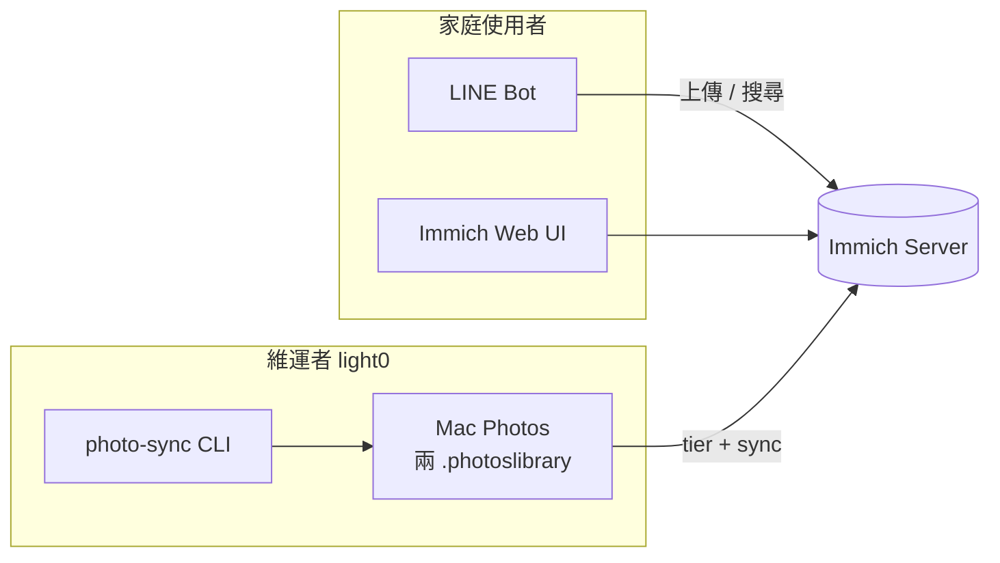

# UX / Product Review — Immich Apps

**日期**: 2026-06-18  
**範圍**: 使用者面向流程（LINE Bot · Immich Web · Mac Photos 維運）與下一階段產品優化  
**SSOT 進度**: [PROGRESS_TRACKING.md](./PROGRESS_TRACKING.md) · **Sprint**: [HOW_TO_PROCEED.md](./HOW_TO_PROCEED.md)

---

## 執行摘要

| 維度 | 現況 | 評分 | 說明 |
| ------ | ------ | ------ | ------ |
| **後端 / 資料正確性** | 強 | ★★★★☆ | Photo sync、reconcile、tier policy 腳本鏈完整；Immich v2.7.5 穩定 |
| **LINE 上傳** | 可用 | ★★★☆☆ | E2E 通過；但「照片 vs 原檔」認知負擔高 |
| **LINE 搜尋** | 進步中 | ★★★★☆ | Qwen + CLIP + Flex carousel 已上線；追問/disambiguation 仍偏文字 |
| **Immich Web** | 依 upstream | ★★★☆☆ | 相簿/時間軸可用；union 兩 library 對一般使用者不直覺 |
| **維運者 UX** | 腳本為主 | ★★☆☆☆ | tier / reconcile 多步 CLI + Photos GUI；缺單一狀態面板 |

**結論**：功能面已接近 Phase 3.5 收尾；**產品體驗下一階段**應聚焦「使用者怎麼找照片、怎麼上傳、怎麼理解兩個圖庫」，以及「維運者怎麼一眼看懂 tier/reconcile 狀態」。

---

## 產品表面（Product Surfaces）



| 表面 | 主要任務 | 設計掌控度 |
| ------ | ---------- | ------------ |
| LINE Bot | 快速分享、自然語言找照片 | **高**（自有程式） |
| Immich Web | 瀏覽、人臉命名、時間軸 | **低**（upstream；僅 config / 相簿策略） |
| Mac Photos + CLI | 分層搬移、purge、reconcile | **中**（GUI 自動化脆弱） |

---

## LINE Bot — UX 檢視

### 上傳流程

| 步驟 | 現況 | 痛點 | 建議 |
| ------ | ------ | ------ | ------ |
| 選擇管道 | 「照片」壓縮 vs「檔案」原檔 | 使用者不知差異；iPhone 無法從照片 App 選檔 | **P1** Rich Menu：「分享照片」「分享原檔」+ 一則圖文教學 |
| 等待回覆 | imageSet 批次 summary | 多張時仍可能覺得慢 | **P2** 處理中 typing indicator / 「上傳中 3/8」 |
| 成功回覆 | 連結 + metadata note | 連結在 LINE 內開瀏覽器體驗一般 | **P2** Flex bubble 單張預覽（與搜尋 carousel 一致） |
| 失敗 | 純文字 ❌ | 缺少可操作的下一步 | **P1** 結構化錯誤：「請改以檔案傳送」+ 圖示說明 |

**設計原則**：LINE = **便利通道**；原檔 SSOT = Photo Sync / Immich App。 onboarding 應反覆傳達此分工，而非假設使用者已讀文件。

### 搜尋流程

| 步驟 | 現況 | 痛點 | 建議 |
| ------ | ------ | ------ | ------ |
| 意圖解析 | Qwen JSON plan + fallback | 偶發誤解口語 | 維持；加 **P2** 意圖確認：「要找小蕊 1.5 歲的照片嗎？」 |
| 人物消歧 | 文字列表 1.2.3 | 無頭像、難辨識 | **P1** Quick Reply 按鈕或 Flex 人名卡片 |
| 結果呈現 | 文字 + Flex carousel 10 張 | 超過 10 張只有文字提示 | **P2** 「查看更多」deep link 到 Immich 預填搜尋 |
| 空結果 | 引導換場景/確認人臉 | 尚可 | **P3** 建議「尚未命名的人物」連結 |
| 幫助 | 靜態範例列表 | 新使用者不知 Bot 能做什麼 | **P1** 首次對話 welcome + Rich Menu「找照片」「怎麼上傳」 |

### LINE 版面（Layout）建議

1. **訊息層級**：先一行摘要（幾張、條件）→ 再 carousel；避免文字與圖同時過長。
2. **Carousel bubble**：目前顯示日期 + UUID 前綴檔名 → 改為 **地點 / 人物 / 場景標籤**（若 API 有）。
3. **品牌一致性**：altText、header 用同一套句式（「找到 N 張：小蕊 · 海邊 · 2024」）。

---

## Immich Web — UX 檢視

> 不 fork Immich UI；透過 **相簿策略、命名、驗收 checklist** 優化。

| 區域 | 現況 | 建議 |
| ------ | ------ | ------ |
| 相簿結構 | `LINE Inbox`、Mac Photos 相簿 | **P1** 固定相簿命名規範文件 + Web 驗收：兩相簿時間軸 |
| 人物命名 | Smart Search / 人臉依賴命名 | **P0** 人工 E2E：確認「小蕊」等 alias 與 LINE 一致 |
| 時間軸 | v2.7.5 EXIF 修復後 | **P0** 抽查 tier 搬移前後日期是否正確 |
| Duplicate UI | Immich 內建 | **P2** similar-images eval 後決定是否教育使用者「合併重複」 |
| 雙 library union | 技術上透明 dedupe | **P3** 對家人說明：「一個網站看全部照片」即可，不必解釋 library |

**Web 驗收 checklist**（P0，見 [HOW_TO_PROCEED.md](./HOW_TO_PROCEED.md)）：

- [ ] `icloud-primary` / `local-archive` 對應相簿在時間軸上日期合理
- [ ] 人物頁面與 LINE 搜尋 alias 一致
- [ ] Smart Search「海邊」與 LINE 結果大致相符

---

## 維運者 UX — Photo Sync / Tier / Reconcile

### 現況

- **優點**：runbook 完整、idempotent 腳本、JSON log 可追蹤。
- **痛點**：
  - 流程跨 **10+ 指令**（export → import → verify → delete-source → purge → reconcile）。
  - Photos.app **GUI 自動化**（`photos_gui_ops.py`）受 macOS 語系、選單結構影響。
  - 狀態分散在 `~/Library/Logs/immich-photo-sync/` 多個 JSON。

### 建議（按優先序）

| 優先 | 項目 | 說明 |
| ------ | ------ | ------ |
| **P1** | `tier-policy-status.sh` 單頁摘要 | 輸出：ismissing、staging、verify、Recently Deleted 數、上次 reconcile orphan 數 |
| **P1** | purge GUI 強化 | `photos_gui_ops.py` 多路徑（View 選單 / Erase Deleted Items）— 進行中 |
| **P2** | 互動式 wizard | `make tier-next` 建議下一步（唯讀建議，不取代 runbook） |
| **P2** | Grafana / 簡易 HTML dashboard | tier + reconcile metrics 從 JSON tail |
| **P3** | 減少 GUI 依賴 | 調查 osxphotos / AppleScript 能否完全避開「全部删除」按鈕 |

### Tier 操作者流程（理想）

```text
status → 缺什麼一目了然
  → download（若 ismissing > 0）
  → export / import / verify
  → delete-source（staging 相簿）
  → purge Recently Deleted
  → reconcile dry-run → apply
  → immich-sync dry-run 0 new
```

---

## 未來功能與 UX（Photo Edit · V1.1）

| 功能 | UX 要點 | 階段 |
| ------ | --------- | ------ |
| Qwen 繁中描述 | LINE 回覆多一段「AI 描述」；Web 看 description | V1.1 P3 |
| Photo Edit BFF | **Before/After** 並排；明確「不覆蓋原圖」 | Phase C |
| LINE「幫這張去背」 | 回傳新 asset Flex + 原圖連結 | Photo Edit A |

詳見 [photo-edit/10_REQUIREMENTS.md](./photo-edit/10_REQUIREMENTS.md)。

---

## 優先序矩陣（功能 + UX）

```text
本週必做（阻擋收尾）
  P0  Web + LINE 人工 E2E 驗收
  P1  Phase B bulk 收尾 · purge · reconcile apply（20 orphan ready，2026-06-18 dry-run）

下週產品體驗
  P1  LINE Rich Menu + 上傳教學 · 人物消歧 Quick Reply
  P1  tier-policy-status 單頁摘要
  P2  上傳成功 Flex 預覽 · 搜尋「查看更多」deep link

Q3 / Defer
  P2  Grafana LINE + Immich dashboard
  P3  Photo Edit UI · Qwen vision 描述
```

---

## 建議 Sprint 拆分

### Sprint A（本週）— 資料正確性關門

1. Phase B import verify 完成（staging `0` 已達標，2026-06-18）
2. `photos_gui_ops.py purge` 實測（中英文 Photos）
3. reconcile `--apply`（20 orphan）→ dry-run `0`
4. P0 E2E checklist 勾完

### Sprint B（下週）— 體驗拋光

1. LINE Rich Menu + welcome 訊息
2. 人物消歧 Quick Reply（或 Flex 二選一 PoC）
3. `tier-policy-status.sh` + README 一節「每日看一眼」
4. 更新 [BACKLOG.md](./BACKLOG.md) UX 區塊

### Sprint C（可選）— 觀測與進階

1. Similar images eval
2. Grafana dashboard
3. Photo Edit PoC

---

## 相關文件

- [HOW_TO_PROCEED.md](./HOW_TO_PROCEED.md) — 本週執行
- [BACKLOG.md](./BACKLOG.md) — UX 待辦已同步
- [phase2-line-bot-mvp/10_REQUIREMENTS.md](../60_completed/phase2-line-bot-mvp/10_REQUIREMENTS.md) — MVP 規格
- [photo-sync/tier-policy/README.md](./photo-sync/tier-policy/README.md) — Phase 3.5
