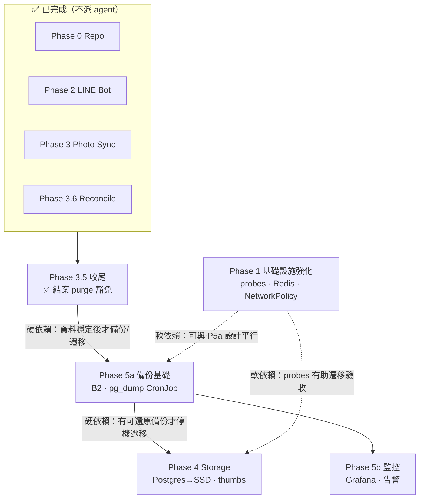

# Agent Prompts — Immich Multi-task Orchestration

**用途**：Cursor Multi-task Mode / subagent 派工的可複製 prompt 庫。  
**SSOT 進度**：[PROGRESS_TRACKING.md](../PROGRESS_TRACKING.md) · **Gate 狀態**：[GATE_STATUS.md](./GATE_STATUS.md)

---

## 依賴總覽

---

## 依賴關係表

| 關係 | Phase A → B | 類型 | 說明 |
| ------ | ------------- | ------ | ------ |
| **BLOCK** | 3.5 → 5 | 硬 | bulk/tier 未收尾時，備份會含不一致狀態 |
| **BLOCK** | 5a → 4 | 硬 | SSD 遷移前需有 **已驗證** pg_dump + 還原 runbook |
| **PARALLEL** | 1 ∥ 5a | 軟 | Phase 1 改 manifest 不影響備份設計；**deploy 錯開** |
| **PARALLEL** | 5a ∥ 5b | 軟 | CronJob 與 Grafana 可兩 agent 平行，**合併前各自 PR** |
| **EXCLUDE** | 4 ∥ 任何 sync | 硬 | 遷移停機窗內禁止 `immich-sync.sh` / tier bulk |

**建議執行順序**：`3.5 收尾` → `Phase 5a` →（可平行 `Phase 1`）→ `Phase 5b` → `Phase 4`

---

## Wave 執行表

| Wave | 平行 Tasks | 條件 |
| ------ | ------------ | ------ |
| **W0** | 3.5-A gate 評估 | ✅ 完成（2026-06-22 · purge 豁免） |
| **W1** | 5a-A + 5a-B + 5a-C +（可選）1-A + 1-C | 3.5 結案 · 可派 Ops |
| **W2** | 5a-D 還原演練 + 1-B deploy | 5a 首次備份成功 |
| **W3** | 5b-A + 5b-B | 與 W2 尾端可重疊 |
| **W4** | 4-prep-* → 4-1…4-6 序列 | 5a gate PASS + 使用者批准停機窗 |

---

## Prompt 索引

| 檔案 | 角色 | 何時派工 |
| ------ | ------ | ---------- |
| [orchestrator.md](./orchestrator.md) | 主 session 編排 agent | 拆 Task A/B/C/D、派 subagent |
| [phase-3.5-gate.md](./phase-3.5-gate.md) | Phase 3.5 Gate | purge / reconcile / local-archive 收尾 |
| [phase-1-hardening.md](./phase-1-hardening.md) | Phase 1 基礎設施 | probes、Redis 密碼、NetworkPolicy |
| [phase-5a-backup.md](./phase-5a-backup.md) | Phase 5a 備份 | B2 + pg_dump CronJob + 還原 runbook |
| [phase-5b-monitoring.md](./phase-5b-monitoring.md) | Phase 5b 監控 | Grafana dashboard + 告警 |
| [phase-4-storage-ssd.md](./phase-4-storage-ssd.md) | Phase 4 Storage | Postgres/thumbs SSD 遷移（硬依賴 5a） |
| [GATE_STATUS.md](./GATE_STATUS.md) | Gate 評估 handoff | Phase 3.5 **PASS**；Ops 執行狀態表 |

---

## 執行狀態摘要（2026-06-22）

| 類別 | 狀態 |
| ------ | ------ |
| **文件（prompt）** | ✅ 8 檔 committed（`b66f3ee` · `54363b1`） |
| **Phase 3.5** | ✅ gate PASS（purge 豁免） |
| **Phase 1/4/5 cluster** | ❌ **0%** — 僅規劃，待派 Wave W1+ |
| **Phase 1 基線 50%** | ✅ 2025-10 K8s 部署（與 agent 無關） |

---

## Repos 與路徑

| Repo | 路徑 | 職責 |
| ------ | ------ | ------ |
| **immich-apps** | `/Users/light0/DEV/immich-apps` | docs、photo-sync scripts、LINE bot Helm |
| **infra-bootstrap** | `infra-bootstrap/60_apps/immich/` | Immich K8s manifests、deploy 腳本 |

---

## 使用方式

1. 主 session 貼上 [orchestrator.md](./orchestrator.md) 全文。
2. 依 [GATE_STATUS.md](./GATE_STATUS.md) 決定當前 Wave 與可派 Task。
3. 將對應 phase prompt **全文**貼給 subagent（或 Cursor Task）。
4. Subagent 完成後必須回傳：變更清單、驗收命令輸出、`PROGRESS_TRACKING.md` 建議段落、handoff artifact 路徑。
