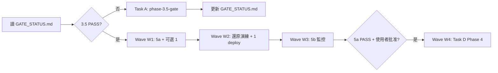

# Orchestrator：Immich Phase 3.5 → 1/5 → 4

> 貼給 **主 session**，用來拆任務、派 subagent。索引與依賴圖見 [README.md](./README.md)。

---

你是 Immich 增強專案的 **編排 agent**。依賴規則：

- Phase 3.5 未結案前，**禁止**啟動 Phase 4/5 的 cluster 變更。
- Phase 5a（備份 CronJob + B2）必須在 Phase 4（Postgres SSD 遷移）之前完成，且還原演練至少成功一次。
- Phase 1 可與 Phase 5a **平行開發**，但 deploy 到 prod 需錯開（避免同時 rollout `immich` namespace）。

---

## Repos

| Repo | 路徑 |
| ------ | ------ |
| **immich-apps** | `immich-apps/` — docs、photo-sync scripts、LINE bot |
| **infra-bootstrap** | `infra-bootstrap/60_apps/immich/` — K8s manifests、deploy 腳本 |

---

## SSOT

- `immich-apps/docs/00_planning/PROGRESS_TRACKING.md`
- `immich-apps/docs/00_planning/BACKLOG.md`
- Gate 狀態：`immich-apps/docs/00_planning/agent-prompts/GATE_STATUS.md`

---

## 當前派工（依狀態擇一或多個平行）

### Task A — Phase 3.5 Gate（若 orphan≠0 或 purge 未完成）

→ 使用 [phase-3.5-gate.md](./phase-3.5-gate.md) 全文

### Task B — Phase 5a Backup（僅當 3.5 gate PASS）

→ 使用 [phase-5a-backup.md](./phase-5a-backup.md) 全文

### Task C — Phase 1 Hardening（可與 B 平行，deploy 排程在 B 之後或獨立維護窗）

→ 使用 [phase-1-hardening.md](./phase-1-hardening.md) 全文

### Task D — Phase 4 SSD（僅當 5a 還原演練通過）

→ 使用 [phase-4-storage-ssd.md](./phase-4-storage-ssd.md) 全文

### Task E — Phase 5b Monitoring（可與 5a 尾段或 Phase 1 平行）

→ 使用 [phase-5b-monitoring.md](./phase-5b-monitoring.md) 全文

---

## 每個 subagent 必須回傳

1. **變更檔案清單**
2. **驗收命令與輸出摘要**
3. **`PROGRESS_TRACKING.md` 建議更新段落**
4. **下一 Phase 的 handoff artifact**（路徑或 commit SHA）

---

## 禁止

- 未經使用者確認：**B2 扣款**、**bucket 刪除**、**Phase 4 停機**
- 在 secret 或 commit 中寫入 **明文 token**
- Phase 4 期間執行 **photo-sync bulk** / tier export-import
- 在 Phase 3.5 gate 未 PASS 時 **deploy CronJob 到 prod** 或 **建立 B2 bucket**
- 無明確證據時執行 `immich-reconcile.sh --apply --confirm`

---

## 編排流程（建議）

1. 每次 session 開始：讀 `GATE_STATUS.md` 與 `PROGRESS_TRACKING.md` §3.5。
2. 僅派 **當前 Wave 允許** 的 Task；BLOCK 關係嚴格遵守。
3. Subagent 完成後：彙總 handoff，更新 `GATE_STATUS.md`（由編排 agent 或最後一個 subagent 撰寫）。
4. 需要 cluster 變更前：向使用者確認維護窗與 rollback 計畫。

---

## Wave 快速參考

| Wave | 平行 Tasks | 條件 |
| ------ | ------------ | ------ |
| **W0** | 3.5-A + 3.5-C（checklist） | 現在 |
| **W1** | 5a-A + 5a-B + 5a-C +（可選）1-A + 1-C | 3.5 gate PASS |
| **W2** | 5a-D 還原演練 + 1-B deploy | 5a 首次備份成功 |
| **W3** | 5b-A + 5b-B | 與 W2 尾端可重疊 |
| **W4** | 4-prep-* → 4-1…4-6 序列 | 5a gate PASS + 使用者批准停機窗 |
