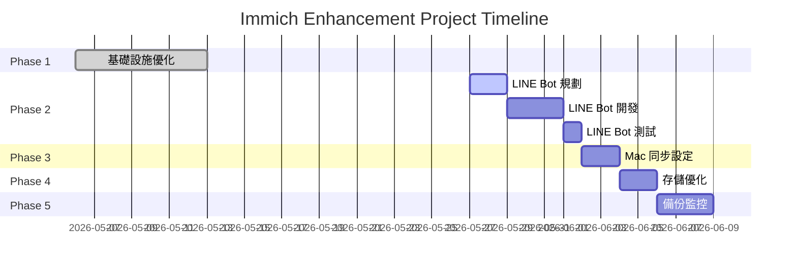

# Immich Enhancement Project - 規劃文件

**專案名稱**: Immich 照片管理系統增強與自動化
**狀態**: 🚧 規劃中
**優先級**: P1
**預估時間**: 2-3 週
**負責人**: Infrastructure Team

---

## 📋 專案概述

將 Immich 照片管理系統從基礎部署提升為具備自動化上傳、AI 標註、多來源同步的完整解決方案。

### 專案目標

1. **自動化上傳**: LINE Bot 整合，支援即時照片上傳
2. **智能標註**: 整合 AI (CLIP + GPT-4V) 自動產生 descriptions、tags、locations
3. **多來源同步**: Mac Photos Library rsync 自動同步
4. **效能優化**: 存儲從 HDD 遷移到 SSD，提升查詢與 ML 性能
5. **備份自動化**: 定期備份到 Backblaze B2 / AWS S3

### 專案價值

| 指標 | 優化前 | 優化後 | 改善 |
| ------ | -------- | -------- | ------ |
| **上傳方式** | 手動 Web/App | LINE Bot 自動 | +100% 便利性 |
| **照片標註** | 手動輸入 | AI 自動產生 | 節省 95% 時間 |
| **ML 處理速度** | HDD 限制 | SSD 加速 | +200-500% |
| **備份頻率** | 手動不定期 | 自動每日 | +100% 可靠性 |

---

## 🏗️ 專案階段

### Phase 1: 基礎設施優化 ✅ (部分完成)

**狀態**: 🟡 50% 完成
**時間**: 已完成部分 (2026-05-06)

#### 已完成 ✅

- [x] Immich 部署到 Kubernetes (immich namespace)
- [x] GPU 加速 ML 服務 (worker3 + NVIDIA GPU)
- [x] 1Password Operator 憑證管理
- [x] MetalLB LoadBalancer (192.168.50.156)
- [x] Caddy 反向代理 (<https://immich.3q.fi>)
- [x] 存儲分析報告 (lama HDD 分析)

#### 待優化 ⏳

- [ ] PostgreSQL 資料庫遷移到 NVMe SSD
- [ ] 縮圖快取優化 (SSD 層)
- [ ] 加入 Health Checks (liveness/readiness probes)
- [ ] Redis 密碼啟用
- [ ] NetworkPolicy 安全隔離

**文檔**:

- [Immich README](../../60_apps/immich/README.md) - 部署文檔
- [Storage Analysis](../living-systems/applications/immich/storage-analysis.md) - 存儲分析

---

### Phase 2: LINE Bot 自動上傳 🚀

**狀態**: 📋 規劃中
**預估時間**: 3-5 天
**優先級**: P1

#### 架構設計

```yaml
┌─────────────┐
│  LINE User  │
│ (Forward 📸)│
└──────┬──────┘
       │
       ↓
┌─────────────────────────────────┐
│     LINE Bot Webhook            │
│  (immich-line-bot deployment)   │
│  Namespace: immich              │
└──────┬──────────────────────────┘
       │
       ├─→ 1. Download Image (LINE Message API)
       │
       ├─→ 2. Upload to Immich (Immich API)
       │
       ├─→ 3. Trigger AI Annotation
       │   ├─→ Immich ML (CLIP - 物件/場景)
       │   └─→ OpenAI GPT-4V (描述生成)
       │
       └─→ 4. Reply to User ("✅ 已上傳!")
```

#### 技術實作

**服務名稱**: `immich-line-bot`
**Namespace**: `immich`
**基礎**: Node.js + TypeScript + @line/bot-sdk

```typescript
// src/services/immich-line-bot/index.ts
import { Client, middleware } from '@line/bot-sdk';
import axios from 'axios';
import FormData from 'form-data';

// LINE Webhook Handler
app.post('/webhook/line', middleware(lineConfig), async (req, res) => {
  const events = req.body.events;

  for (const event of events) {
    if (event.type === 'message' && event.message.type === 'image') {
      await handleImageMessage(event);
    }
  }

  res.json({ status: 'ok' });
});

// 處理圖片訊息
async function handleImageMessage(event: MessageEvent) {
  try {
    // 1. 下載 LINE 圖片
    const imageBuffer = await downloadLineImage(event.message.id);

    // 2. 上傳到 Immich
    const asset = await uploadToImmich(imageBuffer, {
      deviceId: `LINE-${event.source.userId}`,
      deviceAssetId: event.message.id,
    });

    // 3. 等待 ML 處理 (Immich 自動執行 CLIP)
    await waitForMLProcessing(asset.id);

    // 4. 使用 GPT-4V 產生詳細描述
    const description = await generateDescriptionWithGPT4V(imageBuffer);

    // 5. 更新 Immich Asset Metadata
    await updateImmichAsset(asset.id, {
      description,
      tags: ['line-bot', 'auto-upload'],
    });

    // 6. 回覆用戶
    await replyLineMessage(event.replyToken,
      `✅ 照片已上傳到 Immich!\n📝 ${description.substring(0, 50)}...`
    );
  } catch (error) {
    logger.error('Failed to process image', { error, event });
    await replyLineMessage(event.replyToken,
      '❌ 上傳失敗，請稍後再試'
    );
  }
}

// Immich API 上傳
async function uploadToImmich(
  imageBuffer: Buffer,
  deviceInfo: { deviceId: string; deviceAssetId: string }
): Promise<ImmichAsset> {
  const formData = new FormData();
  formData.append('assetData', imageBuffer, 'photo.jpg');
  formData.append('deviceId', deviceInfo.deviceId);
  formData.append('deviceAssetId', deviceInfo.deviceAssetId);

  const response = await axios.post(
    `${IMMICH_SERVER_URL}/api/asset/upload`,
    formData,
    {
      headers: {
        'x-api-key': IMMICH_API_KEY,
        ...formData.getHeaders(),
      },
    }
  );

  return response.data;
}

// GPT-4V 描述生成
async function generateDescriptionWithGPT4V(
  imageBuffer: Buffer
): Promise<string> {
  const base64Image = imageBuffer.toString('base64');

  const response = await axios.post(
    'https://api.openai.com/v1/chat/completions',
    {
      model: 'gpt-4-vision-preview',
      messages: [
        {
          role: 'user',
          content: [
            {
              type: 'text',
              text: '請用繁體中文描述這張照片，包含：場景、物件、氛圍、可能的地點。限 100 字內。',
            },
            {
              type: 'image_url',
              image_url: {
                url: `data:image/jpeg;base64,${base64Image}`,
              },
            },
          ],
        },
      ],
      max_tokens: 300,
    },
    {
      headers: {
        Authorization: `Bearer ${OPENAI_API_KEY}`,
      },
    }
  );

  return response.data.choices[0].message.content;
}
```

#### Kubernetes 部署

```yaml
# 60_apps/immich/line-bot/deployment.yaml
apiVersion: apps/v1
kind: Deployment
metadata:
  name: immich-line-bot
  namespace: immich
  labels:
    app: immich-line-bot
spec:
  replicas: 2  # 高可用
  selector:
    matchLabels:
      app: immich-line-bot
  template:
    metadata:
      labels:
        app: immich-line-bot
    spec:
      containers:
        - name: line-bot
          image: registry.3q.fi/immich-line-bot:latest
          env:
            - name: LINE_CHANNEL_SECRET
              valueFrom:
                secretKeyRef:
                  name: line-bot-credentials
                  key: channel-secret
            - name: LINE_CHANNEL_ACCESS_TOKEN
              valueFrom:
                secretKeyRef:
                  name: line-bot-credentials
                  key: access-token
            - name: IMMICH_API_KEY
              valueFrom:
                secretKeyRef:
                  name: immich-api-credentials
                  key: api-key
            - name: IMMICH_SERVER_URL
              value: "http://immich-server:2283"
            - name: OPENAI_API_KEY
              valueFrom:
                secretKeyRef:
                  name: openai-credentials
                  key: api-key
            - name: NODE_ENV
              value: production
          ports:
            - containerPort: 3000
          resources:
            requests:
              memory: "256Mi"
              cpu: "100m"
            limits:
              memory: "512Mi"
              cpu: "500m"
          livenessProbe:
            httpGet:
              path: /health
              port: 3000
            initialDelaySeconds: 30
            periodSeconds: 10
          readinessProbe:
            httpGet:
              path: /health
              port: 3000
            initialDelaySeconds: 10
            periodSeconds: 5
---
apiVersion: v1
kind: Service
metadata:
  name: immich-line-bot
  namespace: immich
spec:
  selector:
    app: immich-line-bot
  ports:
    - port: 80
      targetPort: 3000
  type: ClusterIP
---
# Ingress for LINE Webhook
apiVersion: networking.k8s.io/v1
kind: Ingress
metadata:
  name: immich-line-bot-ingress
  namespace: immich
  annotations:
    cert-manager.io/cluster-issuer: letsencrypt-prod
    nginx.ingress.kubernetes.io/ssl-redirect: "true"
spec:
  ingressClassName: nginx
  tls:
    - hosts:
        - immich-bot.3q.fi
      secretName: immich-line-bot-tls
  rules:
    - host: immich-bot.3q.fi
      http:
        paths:
          - path: /webhook/line
            pathType: Prefix
            backend:
              service:
                name: immich-line-bot
                port:
                  number: 80
```

#### 1Password Secret 管理

```yaml
# 60_apps/immich/line-bot/1password-items.yaml
---
apiVersion: onepassword.com/v1
kind: OnePasswordItem
metadata:
  name: line-bot-credentials
  namespace: immich
spec:
  itemPath: "vaults/Infra-Apps/items/Immich-LINE-Bot"
---
apiVersion: onepassword.com/v1
kind: OnePasswordItem
metadata:
  name: immich-api-credentials
  namespace: immich
spec:
  itemPath: "vaults/Infra-Apps/items/Immich-API-Key"
---
apiVersion: onepassword.com/v1
kind: OnePasswordItem
metadata:
  name: openai-credentials
  namespace: immich
spec:
  itemPath: "vaults/Infra-Apps/items/OpenAI-API-Key"
```

#### LINE Bot 實作清單

- [ ] 建立 LINE Bot Channel (LINE Developers Console)
- [ ] 建立 Webhook URL: `https://immich-bot.3q.fi/webhook/line`
- [ ] 1Password 設定憑證:
  - [ ] Immich-LINE-Bot (channel secret, access token)
  - [ ] Immich-API-Key (API key)
  - [ ] OpenAI-API-Key
- [ ] 建立 Docker image + CI/CD (Tekton)
- [ ] 部署到 immich namespace
- [ ] 測試 LINE 訊息轉發
- [ ] 監控 Prometheus 指標

**驗收標準**:

- 從 LINE 轉發照片 → 5 秒內收到確認訊息
- Immich Web UI 可見新照片 + AI 描述
- Prometheus 可見上傳延遲指標

---

### Phase 3: Mac Photos Library 自動同步 📂

**狀態**: 📋 規劃中
**預估時間**: 2-3 天
**優先級**: P2

#### 架構選擇

**方案 A: Immich CLI + fswatch (推薦)**

```bash
# Mac 設定腳本: ~/scripts/immich-sync.sh
#!/bin/bash

# Immich CLI 設定
export IMMICH_INSTANCE_URL=https://immich.3q.fi
export IMMICH_API_KEY=<your-api-key>

# Photos Library 路徑
PHOTOS_LIBRARY="$HOME/Pictures/Photos Library.photoslibrary/originals"

# 初次全量上傳
echo "Starting initial sync..."
immich upload "$PHOTOS_LIBRARY"

# 持續監控變更
echo "Starting file watcher..."
fswatch -o "$PHOTOS_LIBRARY" | while read -r change; do
  echo "Detected change: $change"
  immich upload "$PHOTOS_LIBRARY" --recursive
done
```

**Launchd 自動啟動**:

```xml
<!-- ~/Library/LaunchAgents/com.user.immich-sync.plist -->
<?xml version="1.0" encoding="UTF-8"?>
<!DOCTYPE plist PUBLIC "-//Apple//DTD PLIST 1.0//EN" "http://www.apple.com/DTDs/PropertyList-1.0.dtd">
<plist version="1.0">
<dict>
    <key>Label</key>
    <string>com.user.immich-sync</string>
    <key>ProgramArguments</key>
    <array>
        <string>/Users/light0/scripts/immich-sync.sh</string>
    </array>
    <key>RunAtLoad</key>
    <true/>
    <key>KeepAlive</key>
    <true/>
    <key>StandardOutPath</key>
    <string>/tmp/immich-sync.log</string>
    <key>StandardErrorPath</key>
    <string>/tmp/immich-sync-error.log</string>
</dict>
</plist>
```

**方案 B: External Library (rsync + Immich Scan)**

```bash
# Mac → lama rsync
rsync -avz --delete \
  --exclude ".DS_Store" \
  --exclude "Thumbnails/" \
  ~/Pictures/Photos\ Library.photoslibrary/originals/ \
  lama:/mnt/immich/external-library/mac-photos/

# Immich Web UI → Libraries → Scan External Library
```

#### Mac 同步實作清單

- [ ] 在 Mac 安裝 Immich CLI: `npm install -g @immich/cli`
- [ ] 安裝 fswatch: `brew install fswatch`
- [ ] 建立同步腳本
- [ ] 設定 Launchd 自動啟動
- [ ] 測試初次全量同步
- [ ] 驗證增量同步
- [ ] 設定日誌輪轉

**驗收標準**:

- Mac Photos 新增照片 → 5 分鐘內同步到 Immich
- 刪除照片不影響 Immich (單向同步)
- 日誌可追蹤同步狀態

---

### Phase 4: 存儲效能優化 💾

**狀態**: 📋 規劃中
**預估時間**: 1-2 天
**優先級**: P2

#### 當前狀況分析

```bash
# lama 存儲配置
/mnt/immich → sda2 (HDD, 1T, ROTA=1)
/nvme0n1   → NVMe SSD (928.5G, ROTA=0)

# 效能對比
HDD:  1.4 GB/s 寫入, 10.6 GB/s 讀取
SSD:  預估 3-5 GB/s 寫入, 20-30 GB/s 讀取
```

#### 優化策略

**階段 4.1: PostgreSQL 遷移到 SSD**

```bash
# 1. 在 NVMe 建立目錄
ssh lama "sudo mkdir -p /nvme/immich-postgres && sudo chown 999:999 /nvme/immich-postgres"

# 2. 停止 PostgreSQL
kubectl scale deployment immich-postgres -n immich --replicas=0

# 3. 備份資料
kubectl exec -n immich deployment/immich-postgres -- \
  pg_dump -U postgres immich > /tmp/immich-backup.sql

# 4. 複製資料到 SSD
ssh lama "sudo rsync -av /mnt/immich/postgres-data/ /nvme/immich-postgres/"

# 5. 修改 PV hostPath
# immich-local-pv.yaml: path: /nvme/immich-postgres

# 6. 重啟 PostgreSQL
kubectl scale deployment immich-postgres -n immich --replicas=1

# 7. 驗證
kubectl exec -n immich deployment/immich-postgres -- \
  psql -U postgres -c "\dt"
```

**階段 4.2: 縮圖快取 SSD 加速**

```yaml
# immich-deployment.yaml 新增 volume
volumes:
  - name: immich-data
    persistentVolumeClaim:
      claimName: immich-local-pvc  # HDD for originals
  - name: immich-thumbs
    hostPath:
      path: /nvme/immich-thumbs      # SSD for thumbnails
      type: DirectoryOrCreate

volumeMounts:
  - name: immich-data
    mountPath: /data
  - name: immich-thumbs
    mountPath: /data/thumbs
```

#### 存儲優化實作清單

- [ ] 備份 PostgreSQL 資料
- [ ] 建立 NVMe 目錄
- [ ] 遷移 PostgreSQL 到 SSD
- [ ] 測試資料庫效能 (pgbench)
- [ ] 設定縮圖目錄到 SSD
- [ ] 監控 I/O 指標改善

**預期效果**:

- PostgreSQL 查詢延遲: -50%
- ML 處理速度: +200%
- 縮圖載入: +300%

---

### Phase 5: 自動備份與監控 🔄

**狀態**: 📋 規劃中
**預估時間**: 2-3 天
**優先級**: P2

#### 備份架構

```yaml
┌─────────────────┐
│   Immich Data   │
│  (/mnt/immich)  │
└────────┬────────┘
         │
         ├─→ 每日增量: lama → delta (rsync)
         ├─→ 每週全量: lama → Backblaze B2
         └─→ PostgreSQL: pg_dump → S3
```

#### 備份 CronJob

```yaml
# 60_apps/immich/backup-cronjob.yaml
---
apiVersion: batch/v1
kind: CronJob
metadata:
  name: immich-backup-postgres
  namespace: immich
spec:
  schedule: "0 2 * * *"  # 每天凌晨 2 點
  jobTemplate:
    spec:
      template:
        spec:
          restartPolicy: OnFailure
          containers:
          - name: backup
            image: postgres:14
            env:
              - name: POSTGRES_USER
                valueFrom:
                  secretKeyRef:
                    name: immich-postgresql-credentials
                    key: username
              - name: POSTGRES_PASSWORD
                valueFrom:
                  secretKeyRef:
                    name: immich-postgresql-credentials
                    key: password
              - name: POSTGRES_DB
                valueFrom:
                  secretKeyRef:
                    name: immich-postgresql-credentials
                    key: database
              - name: B2_ACCOUNT_ID
                valueFrom:
                  secretKeyRef:
                    name: backblaze-credentials
                    key: account-id
              - name: B2_APPLICATION_KEY
                valueFrom:
                  secretKeyRef:
                    name: backblaze-credentials
                    key: application-key
            command:
            - /bin/bash
            - -c
            - |
              set -e

              # 1. PostgreSQL Dump
              BACKUP_FILE="/tmp/immich-$(date +%Y%m%d-%H%M%S).sql.gz"
              pg_dump -h immich-postgres -U $POSTGRES_USER $POSTGRES_DB | gzip > $BACKUP_FILE

              # 2. 上傳到 B2
              apt-get update && apt-get install -y rclone

              cat > /tmp/rclone.conf <<EOF
              [b2]
              type = b2
              account = $B2_ACCOUNT_ID
              key = $B2_APPLICATION_KEY
              EOF

              rclone --config /tmp/rclone.conf copy $BACKUP_FILE b2:immich-backup/postgres/

              echo "✅ Backup completed: $BACKUP_FILE"
---
# 照片檔案備份 (在 lama 節點執行)
apiVersion: batch/v1
kind: CronJob
metadata:
  name: immich-backup-files
  namespace: immich
spec:
  schedule: "0 3 * * 0"  # 每週日凌晨 3 點
  jobTemplate:
    spec:
      template:
        spec:
          restartPolicy: OnFailure
          nodeSelector:
            kubernetes.io/hostname: lama
          containers:
          - name: backup
            image: rclone/rclone:latest
            env:
              - name: B2_ACCOUNT_ID
                valueFrom:
                  secretKeyRef:
                    name: backblaze-credentials
                    key: account-id
              - name: B2_APPLICATION_KEY
                valueFrom:
                  secretKeyRef:
                    name: backblaze-credentials
                    key: application-key
            volumeMounts:
              - name: immich-data
                mountPath: /data
                readOnly: true
            command:
            - /bin/sh
            - -c
            - |
              set -e

              cat > /tmp/rclone.conf <<EOF
              [b2]
              type = b2
              account = $B2_ACCOUNT_ID
              key = $B2_APPLICATION_KEY
              EOF

              # 同步到 B2 (增量)
              rclone --config /tmp/rclone.conf sync \
                /data/ b2:immich-backup/photos/ \
                --progress \
                --transfers 4 \
                --checkers 8

              echo "✅ Files backup completed"
          volumes:
            - name: immich-data
              persistentVolumeClaim:
                claimName: immich-local-pvc
```

#### Prometheus 監控

```yaml
# 60_apps/immich/servicemonitor.yaml
apiVersion: monitoring.coreos.com/v1
kind: ServiceMonitor
metadata:
  name: immich-monitoring
  namespace: immich
  labels:
    app: immich
spec:
  selector:
    matchLabels:
      app: immich-server
  endpoints:
    - port: http
      path: /api/server-info/metrics
      interval: 30s
```

#### Grafana Dashboard 指標

```yaml
# 關鍵指標
- immich_upload_count_total
- immich_upload_duration_seconds
- immich_ml_processing_duration_seconds
- immich_storage_used_bytes
- immich_asset_count_total
- immich_line_bot_webhook_requests_total
- immich_line_bot_upload_success_rate
```

#### 備份與監控實作清單

- [ ] 建立 Backblaze B2 bucket
- [ ] 1Password 設定 B2 憑證
- [ ] 部署 PostgreSQL 備份 CronJob
- [ ] 部署照片備份 CronJob
- [ ] 測試備份還原流程
- [ ] 設定 Prometheus ServiceMonitor
- [ ] 建立 Grafana Dashboard
- [ ] 設定告警規則 (磁碟空間 > 80%)

**驗收標準**:

- 每日自動備份 PostgreSQL
- 每週自動備份照片檔案
- 備份失敗時發送告警
- Grafana 可視化所有指標

---

## 📊 成功指標

### 功能指標

| 功能 | 指標 | 目標 |
| ------ | ------ | ------ |
| **LINE Bot 上傳** | 成功率 | > 95% |
| **LINE Bot 延遲** | P95 | < 5s |
| **AI 標註準確度** | 用戶滿意度 | > 90% |
| **Mac 同步延遲** | 新照片出現時間 | < 5 min |
| **備份成功率** | 定期執行 | 100% |

### 效能指標

| 指標 | 優化前 | 目標 | 改善 |
| ------ | -------- | ------ | ------ |
| **PostgreSQL 查詢** | HDD | SSD | -50% 延遲 |
| **ML 處理速度** | HDD I/O | SSD I/O | +200% |
| **縮圖載入** | 500-1000ms | 100-200ms | -70% |

### 業務指標

| 指標 | 目標 |
| ------ | ------ |
| **照片上傳頻率** | +300% (LINE Bot) |
| **標註覆蓋率** | 100% (AI 自動) |
| **備份可靠性** | 99.9% uptime |
| **用戶滿意度** | 提升至 9/10 |

---

## 🔗 相關文檔

### 現有文檔

- [Immich README (60_apps)](../../60_apps/immich/README.md) - 部署配置
- [Storage Analysis](../living-systems/applications/immich/storage-analysis.md) - 存儲架構
- [Living Systems - Immich](../living-systems/applications/immich/README.md) - 系統概覽

### 外部資源

- [Immich Official Docs](https://docs.immich.app/)
- [Immich API Reference](https://docs.immich.app/docs/api)
- [LINE Messaging API](https://developers.line.biz/en/docs/messaging-api/)
- [OpenAI Vision API](https://platform.openai.com/docs/guides/vision)

---

## 📝 風險與限制

### 技術風險

| 風險 | 影響 | 緩解措施 |
| ------ | ------ | ---------- |
| **LINE Bot 流量高峰** | 服務過載 | 加入 rate limiting + queue |
| **OpenAI API 成本** | 預算超支 | 設定每日配額 + fallback CLIP only |
| **SSD 容量不足** | PostgreSQL 遷移失敗 | 保留 HDD fallback |
| **備份失敗** | 資料遺失風險 | 多重備份 + 監控告警 |

### 限制

- **Apple Photos 格式**: 僅支援 originals/ 目錄，不含 Live Photos 元數據
- **LINE Bot 圖片品質**: LINE 壓縮後的圖片，非原始解析度
- **GPU 資源**: 單一 worker3 節點，無法水平擴展 ML

---

## ✅ 驗收檢查清單

### Phase 2: LINE Bot

- [ ] LINE Bot Channel 建立並設定 Webhook
- [ ] Kubernetes Deployment 部署成功
- [ ] 1Password 憑證同步正常
- [ ] 從 LINE 轉發照片可成功上傳
- [ ] AI 描述自動產生並顯示在 Immich
- [ ] Prometheus 指標正常收集
- [ ] 錯誤處理與重試機制測試通過

### Phase 3: Mac 同步

- [ ] Immich CLI 安裝並設定
- [ ] Launchd 自動啟動服務正常
- [ ] 初次全量同步完成
- [ ] 增量同步測試通過
- [ ] 日誌記錄正常

### Phase 4: 存儲優化

- [ ] PostgreSQL 備份完成
- [ ] 資料遷移到 SSD 成功
- [ ] 資料庫效能測試達標
- [ ] 縮圖目錄配置完成
- [ ] I/O 監控指標改善

### Phase 5: 備份與監控

- [ ] Backblaze B2 設定完成
- [ ] PostgreSQL 備份 CronJob 正常運行
- [ ] 照片備份 CronJob 正常運行
- [ ] 備份還原測試通過
- [ ] Grafana Dashboard 建立
- [ ] 告警規則設定並測試

---

## 📅 Timeline



**預估完成日期**: 2026-06-15

---

## 🎯 後續計畫

### 未來增強 (Phase 6+)

- [ ] Telegram Bot 整合 (類似 LINE Bot)
- [ ] WhatsApp 整合
- [ ] 自動生成相簿 (基於時間/地點/人物)
- [ ] 人臉辨識改進 (訓練自定義模型)
- [ ] 照片去重與清理建議
- [ ] 多用戶家庭相簿共享

### 技術債務

- [ ] immich-configmap.yaml Nginx 配置清理 (未使用)
- [ ] Redis 密碼啟用
- [ ] NetworkPolicy 實作
- [ ] 所有 Deployment 加入 Health Checks

---

**專案狀態**: 🚧 Phase 2 規劃中
**下一步**: 建立 LINE Bot Channel + 開發環境設定
**文檔維護**: 每週更新進度

**最後更新**: 2026-05-27
**負責人**: Infrastructure Team
