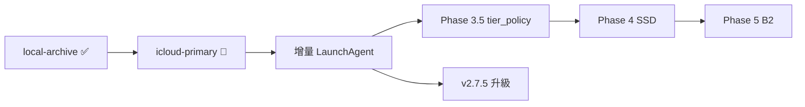

# 如何進行 — Immich Apps 執行指南

**日期**: 2026-06-12  
**Repo**: <https://github.com/dejavux/immich-apps>  
**進度 SSOT**: [PROGRESS_TRACKING.md](./PROGRESS_TRACKING.md)

---

## 📍 當前狀態（2026-06-12）

| 項目 | 狀態 |
|------|------|
| Repo `immich-apps` / **`main`** | ✅ |
| LINE Bot 生產 | ✅ `immich-line-bot:f906783`（V1 搜尋 + Smart Search） |
| Tekton release + PR L0 CI | ✅ |
| Phase 3 local-archive | ✅ **5023/5023**（0 new / 5023 dup） |
| Phase 3 icloud-primary | 🚧 **~22%**（3511 new / 1 dup，~7.2 GB / 32 GB） |
| external-library 清理 | ✅ ~86 GB 已釋放 |
| Immich server | v2.0.1（升級 checklist 就緒） |

**整體進度**: ~**82%**（Phase 2: **92%** · Phase 3: **75%**）

---

## 🎯 現在該做什麼（優先順序）

### 1. 讓 icloud-primary 跑完（P0）

```bash
# 若 terminal 已在跑，勿重複開；中斷後續傳：
./scripts/photo-sync/immich-sync.sh --library icloud-primary

# 監控
tail -f ~/Library/Logs/immich-photo-sync/stats/icloud-primary-run-*.log
```

完成標準：dry-run `0 new`，stats JSON `new_assets=0`。

### 2. Phase 3 收尾

- [ ] icloud dry-run `0 new`
- [ ] LaunchAgent 增量實測（Mac Photos 加 1 張 → 5 分鐘內 Immich 可見）
- [ ] Admin：移除或停用空的 External library「Migrated photos」
- [ ] Immich Web UI 抽查 EXIF / 時間軸

### 3. 升級評估（icloud 完成後）

→ [IMMICH_UPGRADE_v2.7.5.md](./IMMICH_UPGRADE_v2.7.5.md)  
建議：icloud dry-run = 0 new 再進維護窗口；中斷可 hash 續傳。

### 4. 下一階段（Phase 3 結案後）

| Phase | 內容 | 前置 |
|-------|------|------|
| **3.5** | `tier_policy` + osxphotos（iCloud→Local 搬移） | Phase 3 ✅ |
| **4** | PostgreSQL → SSD | pg_dump 備份 |
| **5** | B2 CronJob + 還原測試 | Phase 4 建議先 |
| **V1.1** | Qwen **vision** 繁中描述 | 確認叢集 vision 模型 |

---

## 軌 A — LINE Bot（維護 / 可選）

| 項目 | 狀態 |
|------|------|
| imageSet 批次、tags、metrics | ✅ PR #9 |
| EXIF 優先、OpenAPI、metadata poll | ✅ PR #10–#11 |
| V1 自然語言搜尋 + Smart Search | ✅ `f906783` |
| Grafana dashboard | ⏳ |
| Qwen vision 描述（V1.1） | ⏳ 需 vision 模型 |

```bash
curl -sS https://immich-bot.3q.fi/health
make release   # 程式變更後
```

---

## 軌 B — Photo Sync（當前主軌）

```bash
./scripts/photo-sync/bootstrap-credentials.sh   # 首次
./scripts/photo-sync/immich-sync.sh --library icloud-primary   # 進行中
./scripts/photo-sync/install-launchd.sh         # 增量（全量完成後驗證）
```

→ [PHASE3_PHOTO_SYNC.md](./PHASE3_PHOTO_SYNC.md) · [PHASE3_STORAGE_AUDIT.md](./PHASE3_STORAGE_AUDIT.md) · [scripts/photo-sync/README.md](../scripts/photo-sync/README.md)

**重點認知**（2026-06-12 實測）：

- local + icloud 僅 **1** hash duplicate → union 後 `/data/upload` ~90 GB 是**預期**，非 blob 双份。
- LINE Bot 時間戳 = webhook 收到時間；正確 EXIF 日期靠 Photo Sync。

---

## 軌 C — Ops

- [x] Caddy `immich.3q.fi` / `immich-bot.3q.fi`（infra PR #120）
- [x] Tekton PR CI `immich-l0`
- [ ] Immich server Prometheus scrape 驗證 + Grafana
- [ ] Phase 5 B2

---

## 🗺️ 執行順序（總覽）



---

## 📍 歷史（2026-06-10～11）

Phase 2 Tekton + HTTPS + E2E、PR #7 Photo Sync 腳本、儲存盤點、PR #8 憑證 fix、PR #9 LINE Bot 強化 — 詳見 [PROGRESS_TRACKING.md](./PROGRESS_TRACKING.md) 每週更新。

---

## 🔗 相關

- [PROGRESS_TRACKING.md](./PROGRESS_TRACKING.md) — SSOT
- [PHASE2_K8S_DEPLOYMENT.md](./PHASE2_K8S_DEPLOYMENT.md)
- [PHASE3_EXTERNAL_LIBRARY_CLEANUP.md](./PHASE3_EXTERNAL_LIBRARY_CLEANUP.md)
- [IMMICH_UPGRADE_v2.7.5.md](./IMMICH_UPGRADE_v2.7.5.md)
