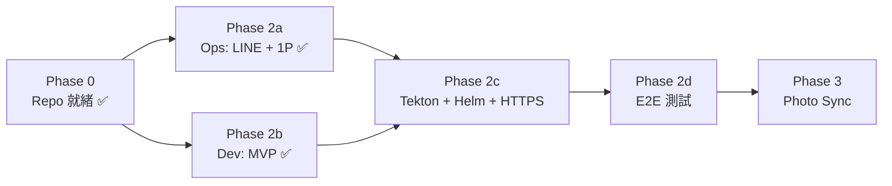

# 如何進行 — Immich Apps 執行指南

**日期**: 2026-06-10  
**Repo**: <https://github.com/dejavux/immich-apps>  
**進度 SSOT**: [PROGRESS_TRACKING.md](./PROGRESS_TRACKING.md)

---

## 📍 當前狀態（2026-06-10）

| 項目 | 狀態 |
|------|------|
| Repo `immich-apps` | ✅ 已建立 |
| Manifests 遷移 | ✅ `deploy/manifests/` |
| 文檔遷移 | ✅ `docs/` |
| Makefile / package.json / Dockerfile | ✅ 就緒 |
| infra-bootstrap 清理 | ✅ 僅保留指向 README |
| Port range | ✅ **30450-30479** |
| LINE Bot 源碼 | ✅ MVP（webhook → Immich upload） |
| LINE Channel / 1Password | ✅ `@189oipta` + Infra-Apps vault |
| Helm chart | ✅ `deploy/helm/immich-line-bot/` 骨架 |
| pf.sh | ✅ `scripts/dev/pf.sh`（30450） |
| K8s 部署規劃 | ✅ [PHASE2_K8S_DEPLOYMENT.md](./PHASE2_K8S_DEPLOYMENT.md) |
| Cursor lint / commit / PR | ✅ [CURSOR_LINT_FIX_AGENT.md](./CURSOR_LINT_FIX_AGENT.md) |
| Tekton + BuildKit release | ⏳ 待實作（`make release` 已接腳本） |
| HTTPS webhook | ⏳ `immich-bot.3q.fi` 待 Caddy/Route53 + deploy |

**整體進度**: ~45%（Phase 0 完成，Phase 2 MVP + Helm 骨架完成，待 CI/CD 部署）

---

## 🗺️ 建議執行順序

分三軌並行：**Ops 軌**（憑證 ✅）、**Dev 軌**（MVP ✅）、**Infra 軌**（Helm + Tekton + HTTPS）。  
生產部署一律 **K8s Deployment + Helm + HTTPS**；ngrok 僅本機 dev。



---

## Phase 2a：Ops（約 1 小時，可今天完成）

**負責**: Ops / 你手動操作  
**阻塞**: 無 — 可立即開始

### Step 1: LINE Developers Console

1. 建立 Messaging API Channel（名稱：`Immich Photo Bot`）
2. Webhook URL（先記下，部署後啟用）:

   ```
   https://immich-bot.3q.fi/webhook/line
   ```

3. 關閉 Auto-reply / Greeting messages
4. 取得 **Channel Secret**、**Channel Access Token**

### Step 2: Immich API Key

1. 登入 <https://immich.3q.fi>
2. Settings → API Keys → Create
3. Name: `LINE Bot`，權限：upload

### Step 3: 1Password（Infra-Apps vault）

| Item | Fields |
|------|--------|
| `Immich-LINE-Bot` | `channel-secret`, `access-token` |
| `Immich-API-Key` | `api-key` |
| `OpenAI-API-Key` | `api-key` |

### Step 4: DNS / Ingress（若尚未存在）

- `immich-bot.3q.fi` → Ingress → `immich-line-bot` Service
- 可參考 `docs/PHASE2_LINE_BOT.md` 的 Ingress YAML

**驗收**: 3 個 1Password items 存在；LINE Console Webhook URL 已填（可先 Verify 關閉，部署後再開）

---

## Phase 2b：Dev — LINE Bot 源碼（2-3 天）

**負責**: Dev  
**參考**: [PHASE2_LINE_BOT.md](./PHASE2_LINE_BOT.md)

### 建議開發順序

```
Day 1  骨架 + webhook 驗證
Day 2  Immich upload + 基本回覆
Day 3  AI 標註（可選 MVP 先跳過 GPT-4V）
Day 4  Helm + 本機 pf 測試
Day 5  K8s 部署 + E2E
```

### Day 1：最小可跑版本

```bash
cd /Users/light0/DEV/immich-apps
npm install

# 建立 src/line-bot/index.ts（Express + /health + /webhook/line）
# 複製 .env.example → .env，填入本機測試用 token

npm run dev   # 或 make dev-line-bot
```

**MVP 功能**:

- [ ] `GET /health` → 200
- [ ] `POST /webhook/line` → LINE signature 驗證
- [ ] 收到 image message → log + 回覆「收到照片」

### Day 2：Immich 上傳

- [ ] `src/shared/immich-client.ts` — upload API
- [ ] 下載 LINE content → multipart upload
- [ ] 成功後回覆 Immich 連結

### Day 3：AI 標註（可分期）

- **MVP**: 僅依賴 Immich ML（CLIP）自動 tag，Bot 不呼叫 OpenAI
- **V1.1**: 加 GPT-4V 描述（見 PHASE2_LINE_BOT.md）

### 本機測試（ngrok 或 pf）

**方案 A — ngrok（Webhook 開發）**:

```bash
ngrok http 3000
# 將 ngrok URL 設到 LINE Console Webhook（暫時）
```

**方案 B — pf + 叢集內測（部署後）**:

```bash
make pf   # 30450 → immich-line-bot
```

---

## Phase 2c：K8s 部署 — Tekton + BuildKit + Helm + HTTPS

**完整規劃 SSOT**: [PHASE2_K8S_DEPLOYMENT.md](./PHASE2_K8S_DEPLOYMENT.md) ⭐

### 架構摘要

| 層 | 方案 |
|----|------|
| 映像建置 | Tekton `ci-tenant-immich-apps` + BuildKit |
| 部署 | `helm upgrade immich-line-bot` → namespace `immich` |
| Webhook | `https://immich-bot.3q.fi/webhook/line` |
| 憑證 | 1Password Operator → K8s Secret |

### Helm chart（已建立骨架）

```
deploy/helm/immich-line-bot/
├── Chart.yaml, values.yaml, values-prod.yaml
└── templates/
    ├── deployment.yaml, service.yaml, ingress.yaml
    └── onepassworditems.yaml
```

### 部署流程

**正式（Tekton 完成後）**:

```bash
make release TAG=v0.1.0   # Tekton BuildKit build + helm deploy
```

**暫時手動（Tekton 完成前）**:

```bash
make build-line-bot IMAGE_TAG=v0.1.0
make deploy-line-bot IMAGE_TAG=v0.1.0
make helm-lint
kubectl get pods -n immich -l app=immich-line-bot
make pf   # 30450 → immich-line-bot:3000
```

### infra-bootstrap 待辦

- `ci-tenant-immich-apps` namespace + RBAC
- Caddyfile 加 `immich-bot.3q.fi`
- Route53 A 記錄 + cert-manager Certificate

### pf.sh（Port 30450）

```bash
./scripts/dev/pf.sh   # 或 make pf
```

Port 分配見 [PORT_RANGE_PLAN.md](./PORT_RANGE_PLAN.md)。

---

## Phase 2d：E2E 驗收

| 測試 | 預期 |
|------|------|
| LINE 轉發照片 | Bot 5 秒內回覆 |
| Immich Web UI | 新照片可見 |
| ML job | CLIP tags 出現（可能需數分鐘） |
| `/metrics` | Prometheus 可 scrape |
| 錯誤路徑 | 非圖片訊息、過大檔案有友善回覆 |

---

## Phase 3：Photo Sync（Phase 2 穩定後）

**平台**: Mac 本機（非 K8s）  
**參考**: [PHASE3_PHOTO_SYNC.md](./PHASE3_PHOTO_SYNC.md)

```bash
# 大致步驟
brew install immich-cli fswatch
# 設定 ~/.config/immich/config.yml
# 部署 launchd plist
# 初次全量 sync → 增量 watch
```

可放在 `src/photo-sync/` + `docs/PHASE3_PHOTO_SYNC.md` 同步更新。

---

## Phase 4-5：Storage / Backup（P2，可排程）

| Phase | 內容 | 依賴 |
|-------|------|------|
| 4 | PostgreSQL HDD → SSD | 維護窗口 + 備份 |
| 5 | Backblaze B2 CronJob | B2 帳號 + rclone |

---

## 🔧 日常開發工作流

```bash
cd /Users/light0/DEV/immich-apps

make lint              # 變更檔 + Cursor lint-fix-agent
make commit            # lint + AI commit
make pull_request      # lint → commit → PR → merge main
make release           # Tekton build + helm deploy
```

詳見 [CURSOR_LINT_FIX_AGENT.md](./CURSOR_LINT_FIX_AGENT.md)。

```bash
make help
make pf                # port-forward 30450
npm run dev            # 本機 LINE Bot
make deploy-line-bot
make logs
```

### 與 infra-bootstrap 的分工

| 職責 | Repo |
|------|------|
| Immich server 運維 manifests（legacy） | `immich-apps/deploy/manifests/` |
| LINE Bot / Photo Sync 開發 | `immich-apps/src/` |
| 叢集基礎設施、MetalLB、1P Operator | `infra-bootstrap` |
| 專案進度 SSOT | `immich-apps/docs/PROGRESS_TRACKING.md` |
| infra 總覽（指向） | `infra-bootstrap/00_docs/planning/PROGRESS_TRACKING.md` |

---

## ⚠️ 風險與決策點

| 議題 | 建議 |
|------|------|
| GPT-4V 成本 | MVP 先不做，靠 Immich ML |
| Webhook 本機測試 | ngrok 或 `make pf`（部署後） |
| 生產部署 | K8s + Helm + HTTPS（見 PHASE2_K8S_DEPLOYMENT.md） |
| Immich server Helm vs kubectl | 短期沿用 `deploy/manifests/`；中期包成 Helm wrapper |
| 預設分支 | `main`（與 fuqi / ibkr / infra-bootstrap 一致） |

---

## 📅 建議時程（從今天起）

| 週 | 目標 |
|----|------|
| **Week 1** (6/10-6/14) | MVP + Helm 骨架 + 1P ✅ |
| **Week 2** (6/15-6/21) | Tekton release + HTTPS + E2E |
| **Week 3** (6/22-6/28) | Photo Sync |
| **Week 4+** | Storage / Backup |

---

## 🔗 相關文檔

- [CURSOR_LINT_FIX_AGENT.md](./CURSOR_LINT_FIX_AGENT.md) — make lint / commit / PR / release
- [PROGRESS_TRACKING.md](./PROGRESS_TRACKING.md) — SSOT，每日更新
- [PHASE2_LINE_BOT.md](./PHASE2_LINE_BOT.md) — 實作細節
- [PORT_RANGE_PLAN.md](./PORT_RANGE_PLAN.md) — Port 30450-30479
- [REPO_CONSOLIDATION_PLAN.md](./REPO_CONSOLIDATION_PLAN.md) — 架構決策

---

**最後更新**: 2026-06-10  
**下一步**: Tekton release pipeline + `immich-bot.3q.fi` HTTPS → 首次 Helm deploy → LINE Webhook Verify
