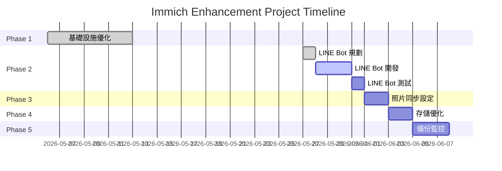

# Immich Enhancement Project

**專案名稱**: Immich 照片管理系統增強與自動化
**狀態**: 🚧 進行中 (Phase 1: 50% | Phase 2: 規劃中)
**優先級**: P1
**預估完成**: 2026-06-15
**負責人**: Infrastructure Team

---

## 📋 專案概述

將 Immich 從基礎部署提升為具備自動化上傳、AI 標註、多來源同步的完整照片管理解決方案。

### 核心目標

1. **自動化上傳**: LINE Bot 即時照片上傳 + AI 標註（**優先**）
2. **多來源同步**: Mac Photos Library 自動同步
3. **效能優化**: 存儲從 HDD 遷移到 SSD
4. **備份自動化**: 定期備份到 Backblaze B2

### 專案價值

| 指標 | 優化前 | 優化後 | 改善 |
|------|--------|--------|------|
| **上傳方式** | 手動 Web/App | LINE Bot 自動 | +100% 便利性 |
| **照片標註** | 手動輸入 | AI 自動產生 | 節省 95% 時間 |
| **ML 處理速度** | HDD 限制 | SSD 加速 | +200-500% |
| **備份頻率** | 手動不定期 | 自動每日 | +100% 可靠性 |

---

## 🏗️ 專案階段

### ✅ Phase 1: 基礎設施 (50% 完成)

**文檔**: [PHASE1_INFRASTRUCTURE.md](./PHASE1_INFRASTRUCTURE.md)

**已完成**:

- Kubernetes 部署 (immich namespace)
- GPU 加速 ML 服務 (worker3)
- 1Password 憑證管理
- LoadBalancer + Caddy 反向代理

**待優化**:

- PostgreSQL 遷移到 SSD
- Health Checks
- NetworkPolicy

---

### 🚀 Phase 2: LINE Bot 自動上傳（**優先**）

> ⚠️ **重要架構決策**: [REPO_ARCHITECTURE_RECOMMENDATION.md](./REPO_ARCHITECTURE_RECOMMENDATION.md)  
> 建議建立**獨立 repo `immich-line-bot`**，不放在 infra-bootstrap

**文檔**: [PHASE2_LINE_BOT.md](./PHASE2_LINE_BOT.md)

**狀態**: 📋 規劃完成，待建立 repo  
**預估**: 3-5 天  
**優先級**: **P0 - 最高優先**

**Repo**: 計畫建立 `immich-line-bot` (獨立 repo)  
**Port Range**: 30430-30439

**功能**:

- LINE 轉發照片 → 自動上傳 Immich
- Immich ML (CLIP) 自動物件辨識
- GPT-4V 生成詳細描述（繁體中文）
- EXIF GPS 反向地理編碼

**技術棧**:

- Node.js + TypeScript
- LINE Messaging API
- OpenAI GPT-4V API
- Helm deployment (immich namespace)

---

### 📂 Phase 3: 照片同步與上傳

**文檔**: [PHASE3_PHOTO_SYNC.md](./PHASE3_PHOTO_SYNC.md)

**狀態**: 📋 規劃中
**預估**: 2-3 天
**優先級**: **P1 - 次優先**

**功能**:

- Mac Photos Library 自動同步
- Immich CLI + fswatch 即時監控
- Launchd 自動啟動服務

---

### 💾 Phase 4: 存儲效能優化

**文檔**: [PHASE4_STORAGE_OPTIMIZATION.md](./PHASE4_STORAGE_OPTIMIZATION.md)

**狀態**: 📋 規劃中
**預估**: 1-2 天
**優先級**: P2

**優化**:

- PostgreSQL → NVMe SSD
- 縮圖快取 → SSD
- 原始照片保留 HDD

**預期改善**:

- PostgreSQL 查詢: -50% 延遲
- ML 處理: +200-500%
- 縮圖載入: +300%

---

### 🔄 Phase 5: 備份與監控

**文檔**: [PHASE5_BACKUP_MONITORING.md](./PHASE5_BACKUP_MONITORING.md)

**狀態**: 📋 規劃中
**預估**: 2-3 天
**優先級**: P2

**功能**:

- PostgreSQL 每日備份 → Backblaze B2
- 照片每週備份 → B2
- Prometheus 監控指標
- Grafana Dashboard

---

## 📊 技術架構

### 當前配置

```yaml
Namespace: immich
├── immich-server (lama)          # 主服務 + 前端
├── immich-machine-learning       # ML 服務
│   └── worker3 (1/4 GPU)        # ✅ 與 qwen (lama) 無衝突
├── immich-postgres (lama)        # PostgreSQL 14
│   └── Storage: HDD → 計畫 SSD
├── immich-redis                  # Valkey 8
└── [計畫中] immich-line-bot      # LINE webhook
```

### GPU 配置

| Node | Total GPU | Used | Available | 用途 |
|------|-----------|------|-----------|------|
| **lama** | 4 | 1 (qwen) | 3 | Immich server + qwen |
| **worker3** | 4 | 1 (immich-ml) | 3 | Immich ML |

**詳見**: [GPU_CONFIGURATION.md](./GPU_CONFIGURATION.md)

---

## 📚 文檔結構

```text
00_docs/projects/immich-enhancement/
├── README.md                           # 本文件 - 專案總覽
├── PROGRESS_TRACKING.md                # ⭐ 進度追蹤 SSOT
├── PHASE1_INFRASTRUCTURE.md            # 基礎設施（50% 完成）
├── PHASE2_LINE_BOT.md                  # LINE Bot（優先）
├── PHASE3_PHOTO_SYNC.md                # 照片同步（次優先）
├── PHASE4_STORAGE_OPTIMIZATION.md      # 存儲優化
├── PHASE5_BACKUP_MONITORING.md         # 備份監控
├── TECHNICAL_ARCHITECTURE.md           # 技術架構
├── GPU_CONFIGURATION.md                # GPU 配置說明
└── IMPLEMENTATION_SUMMARY.md           # 文檔整理摘要（已完成）
```

---

## 📈 成功指標

### 功能指標

| 功能 | 指標 | 目標 | 優先級 |
|------|------|------|--------|
| **LINE Bot 上傳** | 成功率 | > 95% | P0 |
| **LINE Bot 延遲** | P95 | < 5s | P0 |
| **AI 標註準確度** | 用戶滿意度 | > 90% | P0 |
| **Mac 同步延遲** | 新照片出現 | < 5 min | P1 |
| **備份成功率** | 定期執行 | 100% | P2 |

### 效能指標

| 指標 | 優化前 | 目標 | Phase |
|------|--------|------|-------|
| **PostgreSQL 查詢** | HDD | -50% | Phase 4 |
| **ML 處理速度** | HDD I/O | +200% | Phase 4 |
| **縮圖載入** | 500-1000ms | 100-200ms | Phase 4 |

---

## 🎯 當前重點（Week 1）

> 📊 **進度追蹤**: [PROGRESS_TRACKING.md](./PROGRESS_TRACKING.md) - SSOT  
> 🏗️ **架構決策**: [REPO_ARCHITECTURE_RECOMMENDATION.md](./REPO_ARCHITECTURE_RECOMMENDATION.md) - Repo 管理建議

### 立即行動 - Phase 2 準備

**架構決策**: 建立獨立 repo `immich-line-bot`（不放在 infra-bootstrap）

1. **建立 GitHub Repo**
   ```bash
   gh repo create immich-line-bot --public
   ```

2. **初始化專案結構**
   - Node.js + TypeScript
   - Helm charts (deploy/helm/)
   - Port-forward (30430)

3. **1Password 憑證準備**
   - [ ] 建立 `Immich-LINE-Bot` item (Infra-Apps vault)
   - [ ] 建立 `Immich-API-Key` item
   - [ ] 建立 `OpenAI-API-Key` item

**詳見**: [PHASE2_LINE_BOT.md](./PHASE2_LINE_BOT.md) + [REPO_ARCHITECTURE](./REPO_ARCHITECTURE_RECOMMENDATION.md)

---

## 🔗 相關文檔

### 核心文檔

- **[PROGRESS_TRACKING.md](./PROGRESS_TRACKING.md)** - 📊 專案進度追蹤 SSOT（每日更新）
- **[REPO_ARCHITECTURE_RECOMMENDATION.md](./REPO_ARCHITECTURE_RECOMMENDATION.md)** - 🏗️ Repo 管理架構建議（獨立 repo vs monorepo）⭐
- **[QUESTIONS_ANSWERED.md](./QUESTIONS_ANSWERED.md)** - ❓ 三大問題解答（Helm/pf.sh, 源碼放置, PROGRESS_TRACKING）⭐
- **[GPU_CONFIGURATION.md](./GPU_CONFIGURATION.md)** - 🎮 GPU 資源配置詳解

### Phase 實作文檔

- **[PHASE2_LINE_BOT.md](./PHASE2_LINE_BOT.md)** - 🤖 LINE Bot 完整實作（P0，待建立 repo）
- **[PHASE3_PHOTO_SYNC.md](./PHASE3_PHOTO_SYNC.md)** - 📸 Mac Photos 同步實作（P1）

### 歷史文檔

- **[COMPLETION_SUMMARY.md](./COMPLETION_SUMMARY.md)** - ✅ 文檔重構完成總結

### 內部文檔

- [60_apps/immich/](../../../../60_apps/immich/) - Kubernetes 部署配置
- [Living Systems - Immich](../../living-systems/applications/immich/) - 系統概覽
- [Storage Analysis](../../living-systems/applications/immich/storage-analysis.md) - 存儲分析

### 外部資源

- [Immich Official Docs](https://docs.immich.app/)
- [Immich API Reference](https://docs.immich.app/docs/api)
- [LINE Messaging API](https://developers.line.biz/en/docs/messaging-api/)
- [OpenAI Vision API](https://platform.openai.com/docs/guides/vision)

---

## 📅 Timeline



**預估完成日期**: 2026-06-15

---

## ✅ 驗收檢查清單

### Phase 2: LINE Bot（優先）

- [ ] LINE Bot Channel 建立並設定 Webhook
- [ ] 1Password 憑證同步正常
- [ ] Kubernetes Deployment 部署成功
- [ ] 從 LINE 轉發照片可成功上傳
- [ ] AI 描述自動產生（CLIP + GPT-4V）
- [ ] Prometheus 指標正常收集
- [ ] 錯誤處理與重試機制測試通過

### Phase 3: 照片同步

- [ ] Immich CLI 安裝並設定
- [ ] Launchd 自動啟動服務正常
- [ ] 初次全量同步完成
- [ ] 增量同步測試通過

### Phase 4: 存儲優化

- [ ] PostgreSQL 備份完成
- [ ] 資料遷移到 SSD 成功
- [ ] 效能測試達標（-50% 延遲）

### Phase 5: 備份監控

- [ ] Backblaze B2 設定完成
- [ ] 每日/每週備份 CronJob 運行正常
- [ ] Grafana Dashboard 建立

---

## 🎓 後續計畫（Phase 6+）

### 未來增強

- [ ] Telegram Bot 整合（類似 LINE Bot）
- [ ] WhatsApp 整合
- [ ] 自動生成相簿（基於時間/地點/人物）
- [ ] 人臉辨識改進
- [ ] 照片去重與清理建議

### 技術債務

- [ ] immich-configmap.yaml 清理（未使用）
- [ ] Redis 密碼啟用
- [ ] NetworkPolicy 實作
- [ ] Health Checks 補齊

---

**專案狀態**: 🚧 Phase 2 規劃完成，準備實作
**下一步**: LINE Bot Channel 設定 + 開發環境準備
**優先級**: LINE Bot (P0) > Photo Sync (P1) > Storage (P2) > Backup (P2)

**最後更新**: 2026-05-27
**負責人**: Infrastructure Team
